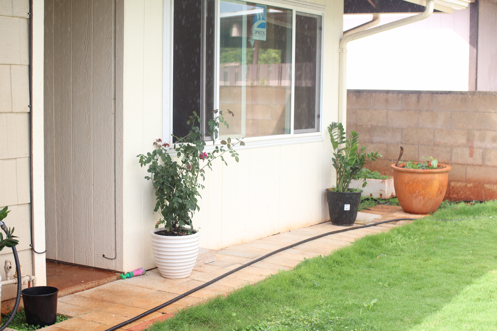

  

During the late 2018, my grandma and some other distant family member were visiting from the mainland. Being the generous family my parents are, they offered a bedroom to our guest while they were visiting Hawaii. I was the unfortunate member of the family that my parents decided to make me give up my bedroom. Afterwards, I told them that I was not sleeping on our old hammock because it was uncomfortable and hurts my back in the morning. I definitely did not want to sleep in my car every single night since it's a cramp little spot and I did not have the finance to rent an Airbnb during our guest's stay.Finally, my dad suggested that we build a new bedroom accross from my brother's room on the patio. At first, I thought he was joking, until he made a list of items, went to Home Depot and and purchase roughly 2000 dollars worth of construction equipments. 

The first couple of weeks into building the bedroom was very slow as neither my dad nor I had the motivation to actually build it. We would constantly glanced over the patio space, think to ourselves and say, "We can start on it tomorrow", for two weeks. Now, two weeks before the guest had arrived, we slowly began to construct the bedroom. Usually, building a new room, or house, requires us to pour cement on the ground and create a foundation. We skipped this step because the ground was already set up. Then, we installed metal holder to hold our big wood stick and form a rectangle size room. Afterwards, we added windows, drywalls, and electrical wiring around the room to make it look like an actual room. Painting it white, let it dry, and installing porcelian flooring. AFter the paint was dry, I moved all my stuff into the bedroom and eventually became comfortable.

From this project, I learned about the challenges of constructions. When setting up the base of the room (Forming a square/rectangle shape) you must think out about what you're planning to install in your room, after the construction is finished. In our case, we spaced our wood pillars at every 1.5 feet in case I plan on mount items on the wall. We also had to make sure that we have enough inventory to finish the bedroom. Another case that popped up is electrical wiring. Dealing with electricity was a challenge for my father since he wasn't sure about how much outlets I would need. As well as properly installing it so it would not be exposed to the enviroment. The most challenging case during this project was installing the drywall. Drywalls are very heavy. When installing the drywall to the roof, we only had one ladder to help hold it up. This means that only one person was able to install the drywall as well as nailing it to the wooden pillars. So, my brothers and I would have to find chairs to stand on, and push the drywalls up while our arms were shaking. 

In the end, my bedroom was completed. To this day (2021-21-01) it remains my bedroom and I couldn't ask for anything more. It's completely perfect and fine the way it is. 
