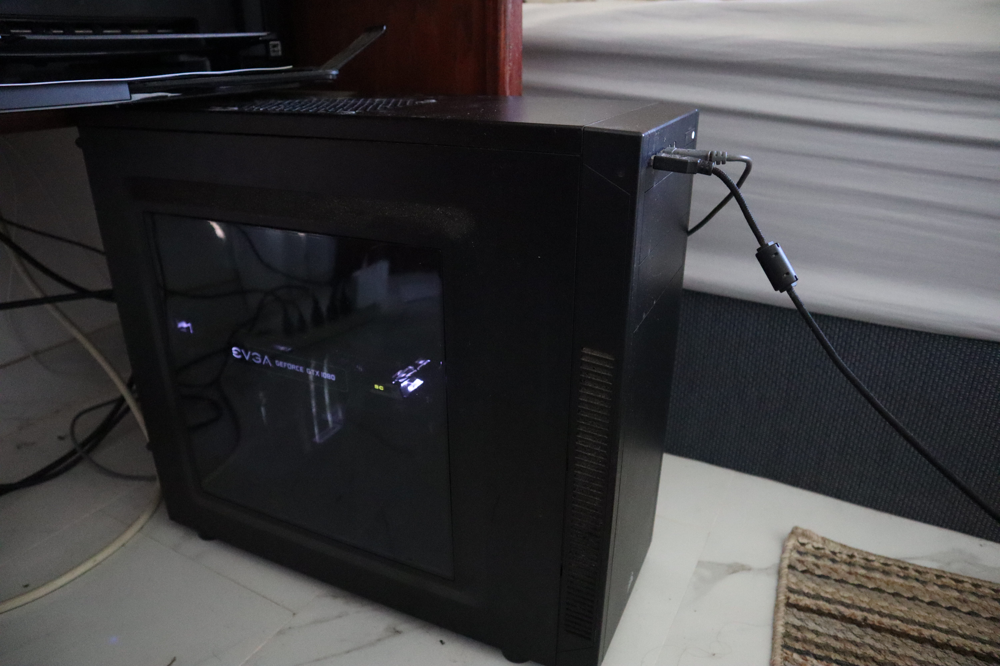

Building a personal desktop was one of the most exciting moments of my life. During this time, my previous desktop was constantly breaking down, overheating and stressful to use. This desktop was a prebuild PC by iBuyPower, which could run games at a fairly good frame rate and I was satasfied with it until maintenance became a hassle. Once it was completely unfixable, I decided to research on computer parts and how they're compatible with each other. Looking up on parts that will fulfill my requirements and started ordering on my mom's credit card, with my hard earn money. Once the parts arrived, I slowly pieced them together and was able to get the desktop I wanted that still works up to this day.

This was an entire solo project, that consisted of me and my high school computer science's teacher assembly tool. Once I received the part, I would bring them to my high school and flex on the younger kids about my awesome computer parts that they couldn't afford. Putting the pieces together, I tested each parts along the progress. I would install the RAM stick, and processor, testing to see if they're functioning or not. Then, installing into the PC case, hook the IO onto the board and tested again. I continued this process until all the parts are assemble and functioning.

Ultimately, I learned patience throughout this project. If I did not take my time to do research, I may have bought parts that were not compatible with each other, wasting time shipping useless products, as well as money. Once I got the product, I had to take my time working each part, otherwise I could end up with a desktop that's not functioning. If that was the case, I would have to dismantle the desktop over and over, which could lead to damage, as well as wasting time. 
